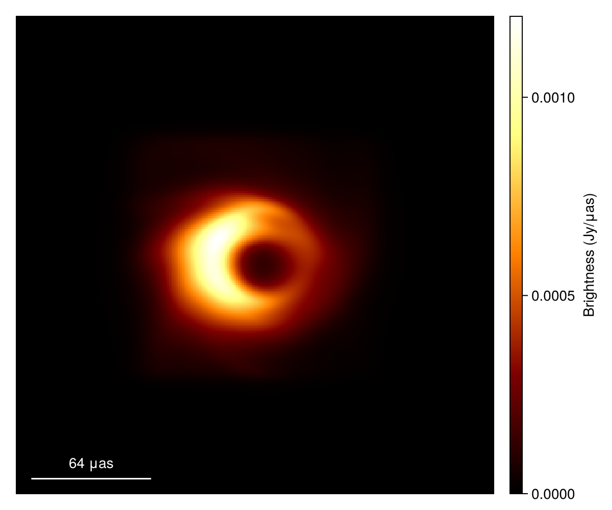
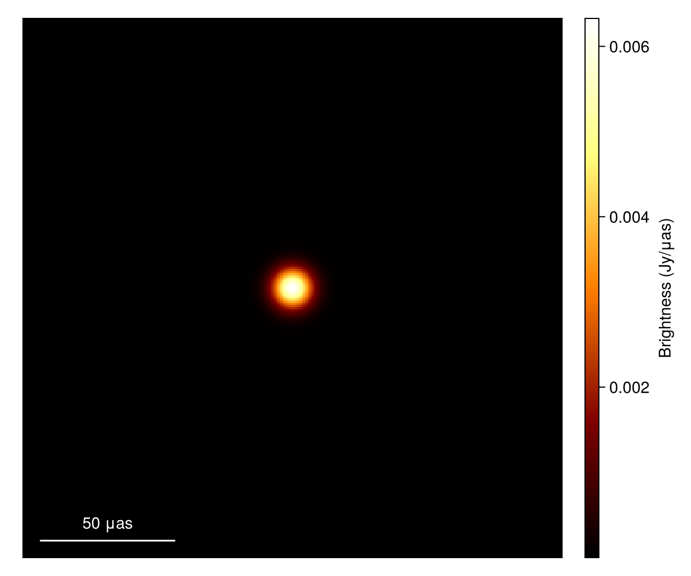
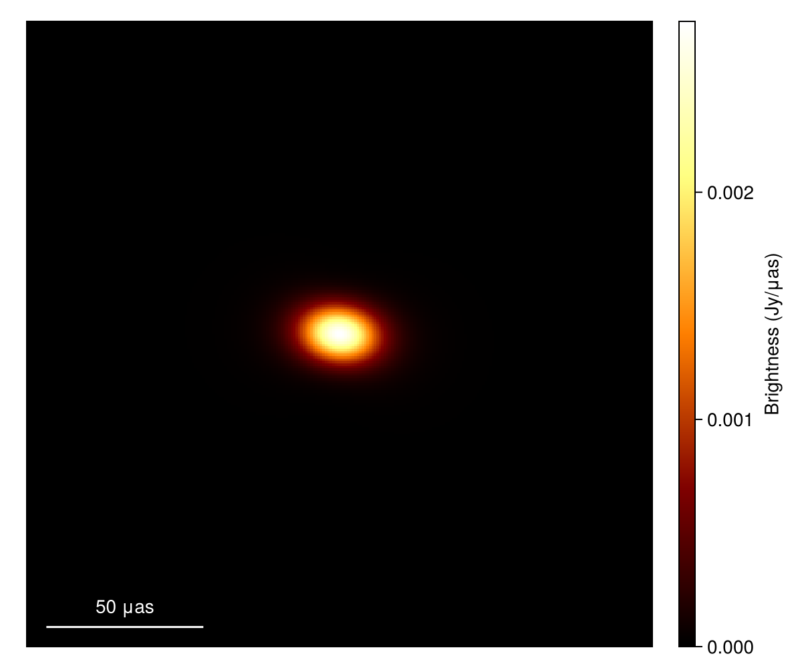
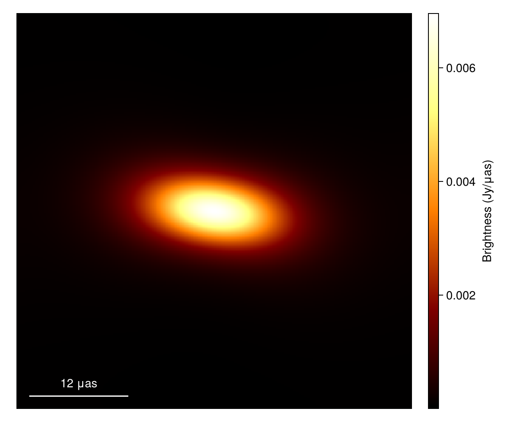
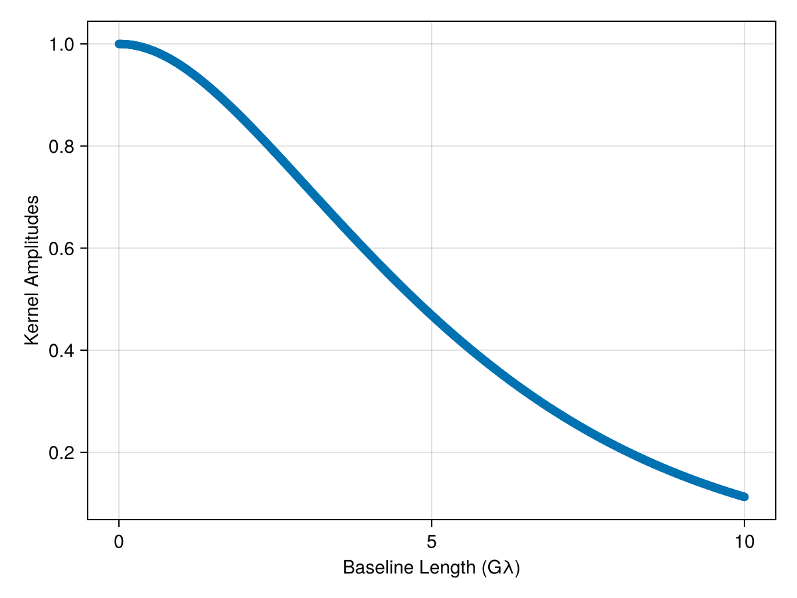

# Simulate Diffractive Scattering {#Simulate-Diffractive-Scattering}

`ScatteringOptics.jl` is designed as a package inside the ecosystem of [`Comrade.jl`](https://github.com/ptiede/Comrade.jl). The scattering model in the package can scatter any sky model types from `Comrade.jl`. This page describes how to simulate diffractive scattering.

## Loading your image {#Loading-your-image}

Here, we use an example image in [`eht-imaging`](https://github.com/achael/eht-imaging). Data can be downloaded from [here](data/jason_mad_eofn.fits). This is a general relativistic magnetohydrodynamic (GRMHD) model of the magnetic arrestic disk originally from [Dexter et al. 2020](https://ui.adsabs.harvard.edu/abs/2020MNRAS.494.4168D/abstract).

```julia
using CairoMakie
# This is the base package for the Skymodel of the Comrade.jl ecosystem
using VLBISkyModels
# Alternatively, you can import Comrade.jl instead. Either works.
# using Comrade

# Load a image model from an image FITS file
im = load_fits("data/jason_mad_eofn.fits", IntensityMap)

# Plot source image
imageviz(im, size=(600, 500), colormap=:afmhot)
```


You can instantiate your scattering model with `ScatteringModel()`. If nothing is specified, the model will use the best-fit parameter set for Sgr A* in [Johnson et al. 2018](https://ui.adsabs.harvard.edu/abs/2018ApJ...865..104J/abstract). 

```julia
using ScatteringOptics

# initialize the scattering model
sm = ScatteringModel()
```


```
DipoleScatteringModel{Float64}(1.38, 8.0e7, 1.38, 0.703, 81.9, 1.0, 8.701673999999999e21, 1.7063921e22, 0.5099457504520795, 0.5879203321591805, 1.9630156472261735, 3.8933699749663195, 10.476370590888147, 3.5025254191248507, 4.04238102210397e19, 5.8567426819253905, 4.650020392426908, 1.2067222894984828, 0.14137166941154058, 27.969627943900058, 0.24094564298608265, 16.43371800974761, 0.10641979388314901, 0.5127694683107693)
```


You can change the parameters if you want to simulate a different scattering screen. See [ScatteringOptics.DipoleScatteringModel](/api#ScatteringOptics.DipoleScatteringModel) for arguments. 

## Simulate diffractive scattering {#Simulate-diffractive-scattering}

As explained in [Brief Introduction to Interstellar Scattering](/math#Brief-Introduction-to-Interstellar-Scattering), diffractive scattering will cause angular broaderning of the resultant image, which is described by the convolution of the source image with a scattering kernel. `ScatteringOptics.jl` implements a `Comrade.jl`&#39;s skymodel of the scattering kernel. You can generate it by 

```julia
# Frequency of the image
νref = metadata(im).frequency
print("Frequency of the image: ", νref/1e9," GHz")

# Create kernel from scattering model
skm = kernelmodel(sm, νref=νref)
```


```
ApproximatedScatteringKernel{Float64, DipoleScatteringModel{Float64}, Float64}(DipoleScatteringModel{Float64}(1.38, 8.0e7, 1.38, 0.703, 81.9, 1.0, 8.701673999999999e21, 1.7063921e22, 0.5099457504520795, 0.5879203321591805, 1.9630156472261735, 3.8933699749663195, 10.476370590888147, 3.5025254191248507, 4.04238102210397e19, 5.8567426819253905, 4.650020392426908, 1.2067222894984828, 0.14137166941154058, 27.969627943900058, 0.24094564298608265, 16.43371800974761, 0.10641979388314901, 0.5127694683107693), 2.29345e11)
```


`skm` is a subtype of `ComradeBase.AbstractModel`, and you can use any methods defined for sky models in `Comrade.jl`&#39;s ecosystem. For instance, you can compute the ensemble-average (or diffractively scattered) image using the `convolve` method from `VLBISkyModels.jl`,

```julia
# scatter the image
im_ea = convolve(im, skm)

# Plot source image
imageviz(im_ea, size=(600, 500), colormap=:afmhot)
```



You can also directly convolve a skymodel from `ComradeBase.AbstractModel` and implemented in `VLBISkyModels.jl`.

```julia
# Gaussian model from VLBISkyModels.jl
g = stretched(Gaussian(), μas2rad(5.0), μas2rad(5.0))
im_g = intensitymap(g, imagepixels(μas2rad(200.0), μas2rad(200.0), 256, 256))

# Plot source image
imageviz(im_g, size=(600, 500), colormap=:afmhot)
```



Scattered model and image can be generated by,

```julia
g_ea = convolved(g, skm)
im_gea = intensitymap(g_ea, imagepixels(μas2rad(200.0), μas2rad(200.0), 256, 256))

# Plot source image
imageviz(im_gea, size=(600, 500), colormap=:afmhot)
```



You can also plot the scattering kernel. For instance in the image domain,

```julia
# make an image model of the scattering kernel
im_skm = intensitymap(skm, imagepixels(μas2rad(50.0), μas2rad(50.0), 256, 256))

# Plot source image
imageviz(im_skm, size=(600, 500), colormap=:afmhot)
```



You can compute the kernel visibility using `visibility_point` method from `VLBISkyModels.jl`. For instance,

```julia
# computing kernels from 0 to 10 Glambda along RA
u = LinRange(0,10e9,1000)
vis = [visibility_point(skm, (U=u, V=0, Fr=νref)) for u=u]

# Plot source image
f = Figure()
ax = Axis(f[1, 1],
    xlabel="Baseline Length (Gλ)",
    ylabel="Kernel Amplitudes",
)
plot!(ax, u/1e9, abs.(vis))
f
```



## A quick shortcut {#A-quick-shortcut}

The above tutorial is intentionally written in a low level. There is [ensembleaverage](/api#ScatteringOptics.ensembleaverage) method to do a quick shortcut by bypassing the kernel generation.

```julia
# scatter the image
im_ea_2 = ensembleaverage(sm, im)

# Plot source image
imageviz(im_ea_2, size=(600, 500), colormap=:afmhot)
```


Although this is handy, it may have an extra overhead to initialize `skm` which may slow down highly iterative processes.  [ensembleaverage](/api#ScatteringOptics.ensembleaverage) method also supports more general skymodels in `ComradeBase.AbstractModel` as an input instead of the image model.

## Save the tutorial data {#Save-the-tutorial-data}

The output images may be saved to fits files. Here, we save the images generated in the tutorial above. 

```julia
# Ensemble average image of provided EHT fits file
save_fits("data/im_ea.fits", im_ea)
# Gaussian model and its scattered ensemble average image
save_fits("data/im_g.fits", im_g)
save_fits("data/im_gea.fits", im_gea)
# Scattering kernel
save_fits("data/im_skm.fits", im_skm)
```


You can download generated files from here ([im_ea.fits](data/im_ea.fits), [im_g.fits](data/im_ea.fits), [im_gea.fits](data/im_gea.fits), [im_skm.fits](data/im_skm.fits),)

We also save the kernel visibilities calculated in the tutorial. 

```julia
using HDF5

# Save the computed kernel data
h5open("data/kernel.h5", "w") do file
    file["u"] = collect(u)
    file["vis"] = vis
end
```


```
1000-element Vector{ComplexF64}:
                 1.0 + 0.0im
  0.9999954071523528 + 0.0im
  0.9999816289767681 + 0.0im
  0.9999586665751884 + 0.0im
  0.9999265217837584 + 0.0im
  0.9998851971721843 + 0.0im
  0.9998346960428404 + 0.0im
  0.9997750224296191 + 0.0im
  0.9997061810965293 + 0.0im
  0.9996281775360422 + 0.0im
                     ⋮
 0.11559473637711046 + 0.0im
 0.11522330025187441 + 0.0im
 0.11485290794090472 + 0.0im
 0.11448355715840004 + 0.0im
 0.11411524562062209 + 0.0im
 0.11374797104590981 + 0.0im
 0.11338173115469348 + 0.0im
 0.11301652366950847 + 0.0im
 0.11265234631500975 + 0.0im
```


You can find the generated file from [here](data/kernel.h5).
