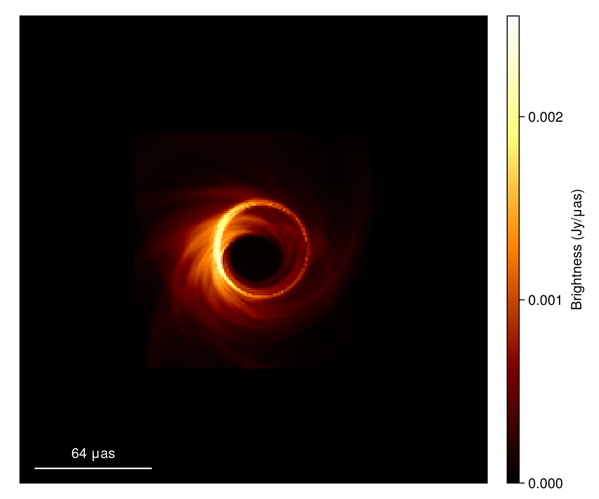
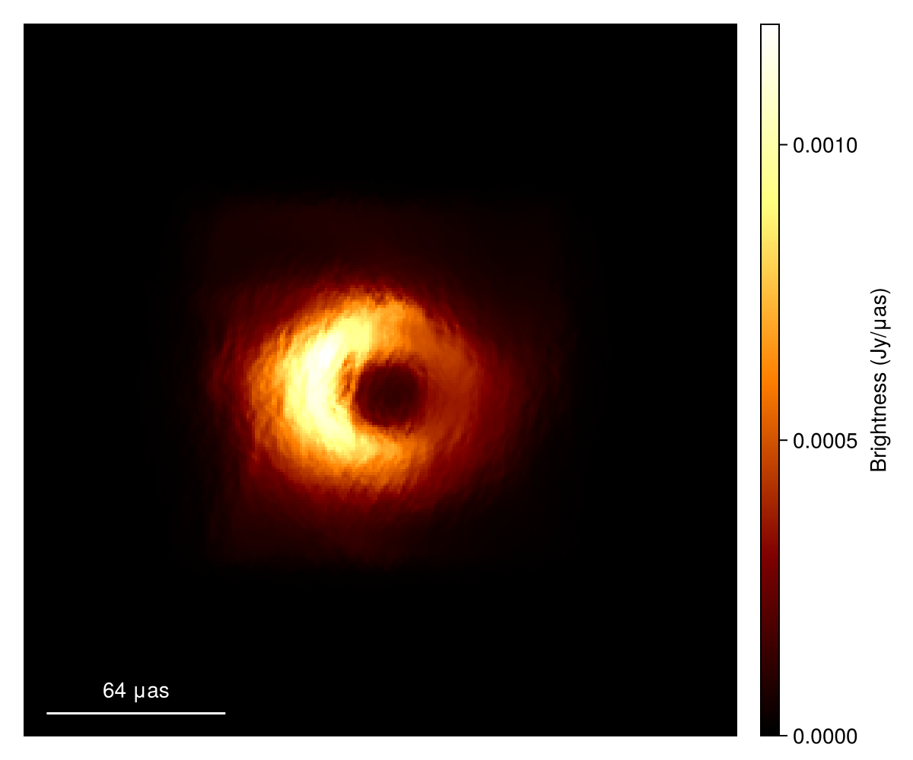
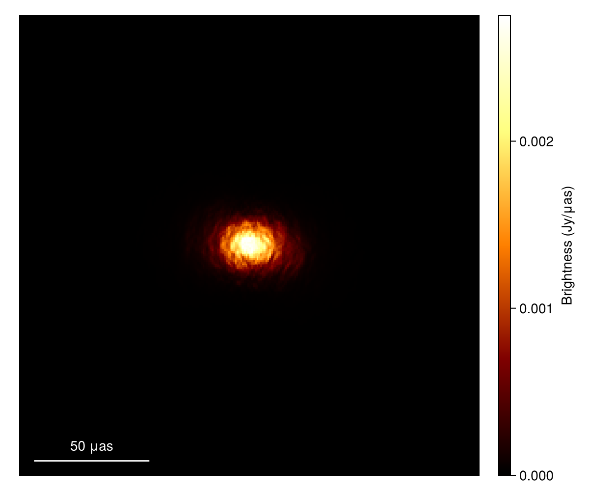

# Simulate Refractive Scattering {#Simulate-Refractive-Scattering}

Another feature of `ScatteringOptics.jl` is simulating refractive scattering. This page gives a tutorial to simulate refractive scattering effects. 

## Loading your image {#Loading-your-image}

Again, we use an example image in [`eht-imaging`](https://github.com/achael/eht-imaging). Data can be downloaded from [here](data/jason_mad_eofn.fits). This is a general relativistic magnetohydrodynamic (GRMHD) model of the magnetic arrestic disk originally from [Dexter et al. 2020](https://ui.adsabs.harvard.edu/abs/2020MNRAS.494.4168D/abstract).

```julia
using CairoMakie
# This is the base package for the Skymodel of the Comrade.jl ecosystem
using VLBISkyModels
# Alternatively, you can import Comrade.jl instead. Either works.
# using Comrade

# Load a image model from an image FITS file
im = load_fits("data/jason_mad_eofn.fits", IntensityMap)

# Frequency of the image
νref = metadata(im).frequency
print("Frequency of the image: ", νref/1e9," GHz")

# Plot source image
imageviz(im, size=(600, 500), colormap=:afmhot)
```



## Simulating Refractive Scattering {#Simulating-Refractive-Scattering}

And, then again initialize a scattering model.

```julia
using ScatteringOptics

# initialize the scattering model
sm = ScatteringModel()
```


```
DipoleScatteringModel{Float64}(1.38, 8.0e7, 1.38, 0.703, 81.9, 1.0, 8.701673999999999e21, 1.7063921e22, 0.5099457504520795, 0.5879203321591805, 1.9630156472261735, 3.8933699749663195, 10.476370590888147, 3.5025254191248507, 4.04238102210397e19, 5.8567426819253905, 4.650020392426908, 1.2067222894984828, 0.14137166941154058, 27.969627943900058, 0.24094564298608265, 16.43371800974761, 0.10641979388314901, 0.5127694683107693)
```


Refractive scattering will distort the diffractively-scattered (i.e. emsemble-average) image and add compact substrucures so-called _refractive substructures_. These effects will be simulated with a phase screen generated from the probabilistic magnetic field wander model of the intersteller medium implemented in the scattering model. 

First, let&#39;s initialize a phase screen model ([RefractivePhaseScreen](/api#ScatteringOptics.RefractivePhaseScreen)) from the scattering model and the model image.

```julia
# Initialize a refractive phase screen model from scattering and image models
rps = refractivephasescreen(sm, im)

# Alternatively, you may make the screen model for arbitral grid
#   ScatteringOptics is design to work even if ScatteringScreen's grid is not consistent
#   with the image you want to scatter, thanks to a powerful interpolation scheme available.
# rps = RefractivePhaseScreen(sm, Nx, Ny, dx_rad, dy_rad)
```


```
RefractivePhaseScreen{DipoleScatteringModel{Float64}, Float64, StationaryRandomFields.NoiseSignal, PhaseScreenPowerLaw{2, DipoleScatteringModel{Float64}, Float64}}(DipoleScatteringModel{Float64}(1.38, 8.0e7, 1.38, 0.703, 81.9, 1.0, 8.701673999999999e21, 1.7063921e22, 0.5099457504520795, 0.5879203321591805, 1.9630156472261735, 3.8933699749663195, 10.476370590888147, 3.5025254191248507, 4.04238102210397e19, 5.8567426819253905, 4.650020392426908, 1.2067222894984828, 0.14137166941154058, 27.969627943900058, 0.24094564298608265, 16.43371800974761, 0.10641979388314901, 0.5127694683107693), 4.218690603755095e10, 4.218690603755095e10, StationaryRandomFields.NoiseSignal{Tuple{Int64, Int64}}((256, 256)), PhaseScreenPowerLaw{2, DipoleScatteringModel{Float64}, Float64}(DipoleScatteringModel{Float64}(1.38, 8.0e7, 1.38, 0.703, 81.9, 1.0, 8.701673999999999e21, 1.7063921e22, 0.5099457504520795, 0.5879203321591805, 1.9630156472261735, 3.8933699749663195, 10.476370590888147, 3.5025254191248507, 4.04238102210397e19, 5.8567426819253905, 4.650020392426908, 1.2067222894984828, 0.14137166941154058, 27.969627943900058, 0.24094564298608265, 16.43371800974761, 0.10641979388314901, 0.5127694683107693), 4.218690603755095e10, 4.218690603755095e10, 0.0, 0.0))
```


You can sample a Gaussian noise in the Fourier domain.

```julia
# Generate a phase screen. For this particular tutorial we will use StableRNG for the reproducibility.
using StableRNGs
rng = StableRNG(123)
noise_screen = generate_gaussian_noise(rps; rng=rng)
```


```
129×256 Matrix{ComplexF64}:
        0.0+0.0im        -1.42237+0.211806im     …    -0.14404-1.46535im
   0.471559+1.23739im    0.660122+0.0873872im         -0.54038-0.185399im
  -0.888559-0.219822im  -0.476492+0.793291im         -0.614426-1.14927im
  -0.060101+0.194956im   0.185724+0.00740253im       0.0029722+0.315275im
 -0.0666618-0.12437im   -0.313947-0.317471im         -0.659719+0.615051im
   0.691469-0.418463im  -0.229056+0.436795im     …  -0.0913364-1.38856im
   -0.47423-1.34245im     1.15835-1.36531im          -0.487128-0.136273im
  -0.505398-0.145882im   0.472817-0.502366im         -0.768268-0.5478im
  -0.683912+0.158674im   -1.26309+0.77461im           0.677391-0.3282im
  -0.964627-0.33336im     0.53031-1.0641im          -0.0528775-0.864448im
           ⋮                                     ⋱            ⋮
   -1.21983+0.583945im  -0.683662+0.615531im     …    0.513594+0.723873im
   0.094109+0.206076im  0.0302826+0.15087im            -1.0777+0.49935im
   0.549581+0.862441im  -0.288871+0.719656im          0.717905-0.790146im
  -0.283655+0.505174im  -0.451472+0.0615803im         0.645413-0.971754im
 -0.0350022-1.03477im    -1.21324-0.15738im          -0.142354-0.245928im
   0.470806+0.257644im  -0.713483+0.000997682im  …   0.0947333+1.46063im
    0.34574-1.17356im     0.33842+0.00476794im       0.0671579-0.676809im
  -0.625574-0.668117im  -0.784044+0.289585im          0.440891-0.59245im
   -1.18389+0.0im       -0.771524+1.35287im            0.50275-0.443054im
```


This Gaussian noise will be scaled with the powerspectrum of the phase screen, and then transformed into the actual phase screen. The fully scattered image can be generated by [scatter_image](/api#ScatteringOptics.scatter_image-Tuple{AbstractPhaseScreen,%20ComradeBase.IntensityMap}) method.

```julia
# Produce the scattered image
im_a = scatter_image(rps, im; noise_screen=noise_screen)

# Plot source image
imageviz(im_a, size=(600, 500), colormap=:afmhot)
```


If you completely randomize the process, you can skip the step to generate `noise_screen` and specify it in the argument of [scatter_image](/api#ScatteringOptics.scatter_image-Tuple{AbstractPhaseScreen,%20ComradeBase.IntensityMap}) method. In this case, the screen will be automatically generated inside [scatter_image](/api#ScatteringOptics.scatter_image-Tuple{AbstractPhaseScreen,%20ComradeBase.IntensityMap}) method. 

There is a quick shortcut bypassing the noise screen generation, which has a less flexibility and a larger overhead for iterative processes.

```julia
# Produce scattered image with observing wavelength .13 cm
im_a2 = scatter_image(sm, im; rng=rng)

# Plot source image
imageviz(im_a2, size=(600, 500), colormap=:afmhot)
```



Just because the refractive scattering effects cannot be described analytically in Fourier domain, [scatter_image](/api#ScatteringOptics.scatter_image-Tuple{AbstractPhaseScreen,%20ComradeBase.IntensityMap}) method only works for the image models (`::IntensityMap`). For sky models in `VLBISkyModels.jl`, you need to first instantiate an image model of your sky model.

Here we show an example using a simple Gaussian model. You need to create an image model with `intensitymap` method from `VLBISkyModels.jl`.

```julia
# Gaussian model from VLBISkyModels.jl
g = stretched(Gaussian(), μas2rad(5.0), μas2rad(5.0))

# Create an image model from the Gaussian model
im_g = intensitymap(g, imagepixels(μas2rad(200.0), μas2rad(200.0), 256, 256))

# Plot source image
imageviz(im_g, size=(600, 500), colormap=:afmhot)
```


Then you can make a scattered image. Don&#39;t forget to add the observing frequency as im_g doesn&#39;t have a frequency information.

```julia
# Produce scattered image. Don't forget to add the observing frequency as im_g doesn't have a frequency information.
im_ga = scatter_image(sm, im_g; rng=rng, νref=νref)

# Plot source image
imageviz(im_ga, size=(600, 500), colormap=:afmhot)
```



## Save the tutorial data {#Save-the-tutorial-data}

The output images may be saved to fits files. Here, we save the images generated in the tutorial above.

```julia
# Average image of provided EHT fits file
save_fits("data/im_a.fits", im_a)
# Scattered average image of Gaussian model
save_fits("data/im_ga.fits", im_ga)
```


The saved files are available here ([im_a.fits](data/im_a.fits), [im_ga.fits](data/im_a.fits))
