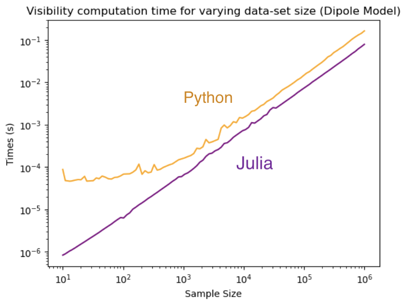
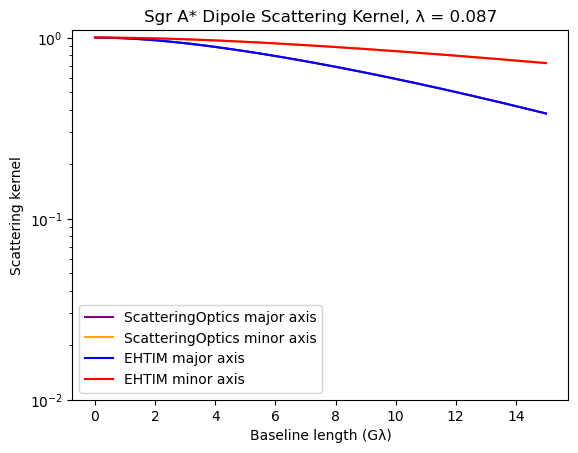
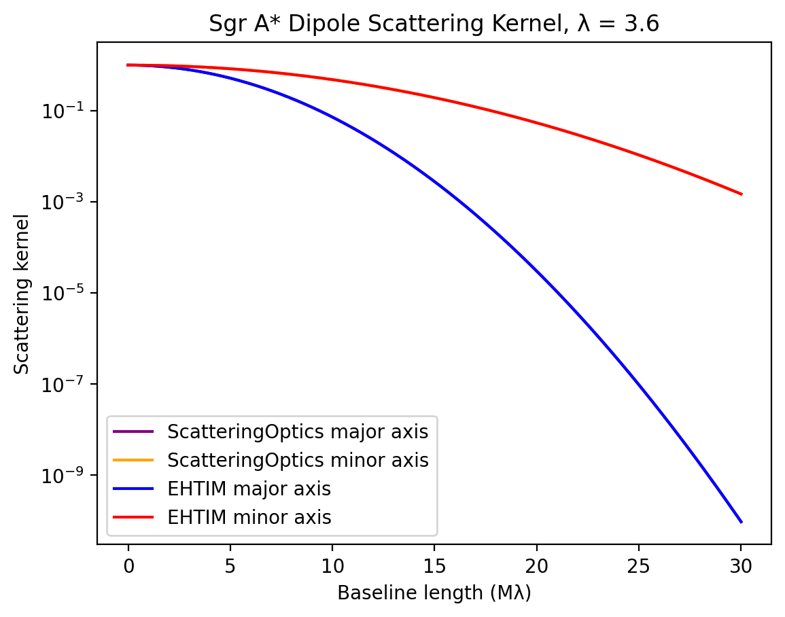

```@meta
CurrentModule = ScatteringOptics
```
# Benchmarks
The Julia implementation of the EHT scattering framework takes advantage of Julia's fast Auto-Differentiation (AD) capabilities, which accelerate the simulation of interstellar scattering. As the overall imaging process can consist of thousands to tens of thousands of iterations in order to optimize scattering parameters and the final output image, even a small imprdovements in simulation speed can result in significant cuts in runtime. It is then crucial that our implementation performs faster than the existing python framework, `eht-imaging`, and produces consistent results. Here, we present benchmarks between the two implementations.

## Speed

With Julia's speed improvements, the `ScatteringOptics.jl` scattering model loads 100 times faster than the `eht-imaging`'s scattering model, which both require to semi-analytically solve co-efficients and precompute the phase structure function for the corresponding scattering parameters. 

The scattering kernel may be called upon to compute visibilities for a given sample of Fourier space points (see [Simulate Diffractive Scattering](@ref) for the tutorial), which is important to mitigate the diffractive scattering in the sky model (e.g. image) reconstruction. In these computations, `ScatteringOptics.jl` also exhibits speed improvements up to 100 times over the three included models (Dipole, Boxcar, and Von Mises; see [Use Non-default Models](@ref) for more info) and varying observing wavelengths. These computation runtimes are compared over a range of sample in the plots below. 

:::tabs

== Dipole Model



== Periodic Boxcar Model


== von Mises Model


:::

With this significant speed up, the Julia implementation paves the pathway for the joint modeling of scattering parameters and reconstructed images in self-consistent way. 

## Consistency

Our scattering kernel produces visibilities that are consistent with those computed by `eht-imaging` across all 3 kernel models as well as the range of standard observing wavelengths in radio astronomy. Below, we demonstrate this by plotting the Dipole kernel over the Fourier space major and minor axis for both the Julia and Python implementations in one plot per observing wavelength. The lines completely overlap, indicating complete consistency in results. All fractional errors between the two implementations range on the order of $10^{-6}$ and $10^{-7}$, which is well under scattering kernel uncertainty limits.

:::tabs

== Dipole Model's Kernel at 0.87 mm



== Dipole Model's Kernel at 3.6 cm


