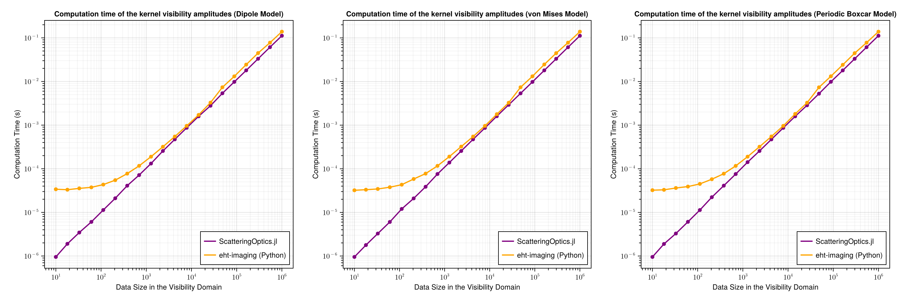
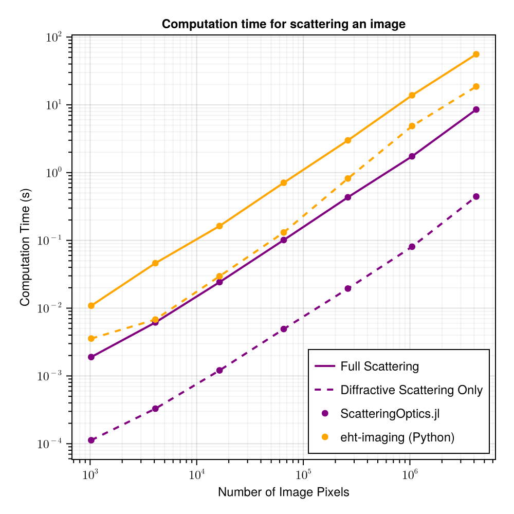
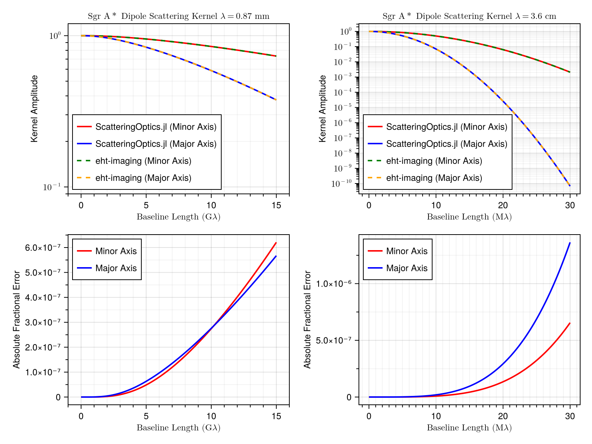

```@meta
CurrentModule = ScatteringOptics
```
# Benchmarks
The Julia implementation of the EHT scattering framework takes advantage of Julia's fast Auto-Differentiation (AD) capabilities, which accelerate the simulation of interstellar scattering. As the overall imaging process can consist of thousands to tens of thousands of iterations in order to optimize scattering parameters and the final output image, even a small imprdovements in simulation speed can result in significant cuts in runtime. It is then crucial that our implementation performs faster than the existing python framework, `eht-imaging`, and produces consistent results. Here, we present benchmarks between the two implementations.

All the examples are in `examples/benchmarks` directories. In below, benchmark results were obtained under the following enviroment.
- Ubuntu 22.04 LTS
- Intel(R) Core(TM) i7-5820K CPU @ 3.30GHz
- Julia Version 1.10.6
- ScatteringOptics v0.1.6
- Python 3.11 (installed through mamba/miniforge3)
- eht-imaging v1.2.8

You can set up your own enviroment by
```bash
# this command will use mamba command. You can instead use conda command by editing the script.
bash setup_python.bash
```
or alternatively you can reproduce the enviroment tested by
```bash
# you can replace mamba with conda
mamba install --name py311_sobenchmark --file conda_list.txt

# or alternatively
mamba install --name py311_sobenchmark --file conta_explicit_env.txt
```

Then you can run all the tests by
```bash
bash run_benchmark.bash
```
It will take about an hour.

## Model initialization
Both `eht-imaging` and `ScatteringOptics.jl` solves semi-analytic equations to precompute constants (e.g. concentration parameter) required for the phase structure function and other related functions, for the given input scattering parameters. 
For the future implementation of the joint inference for the scattering parameters, it is important that the model initialization is fast enough for a large number of iterations.


| Package              | Dipole (Default)  |   von Mises       | Periodic BoxCar     | 
| -------------------- | ----------------  | ----------------  | ------------------  |
| ScatteringOptics.jl  |  0.26 +/- 0.15 ms |  0.17 +/- 0.08 ms |   0.51 +/- 0.11 ms  |
| eht-imaging (Python) | 22.86 +/- 1.53 ms | 15.99 +/- 1.58 ms | 149.24 +/- 6.79 ms  |

This shows `ScatteringOptics.jl` gives about 90-100 times speed boost for Dipole and von Mises models, and 300 times speed boost for the Periodic Boxcar model.
The benchmark scripts are available in `examples/0_model_initialization`, and can be executed with
```bash
# run both python and julia
bash run.bash
```

With this significant speed up, the Julia implementation paves the pathway for the joint modeling of scattering parameters and reconstructed images in self-consistent way. 

## Scattering kernel computations
The scattering kernel may be called upon to compute visibilities for a given sample of Fourier space points (see [Simulate Diffractive Scattering](@ref) for the tutorial), which is important to mitigate the diffractive scattering in the sky model (e.g. image) reconstruction. 
Once the scattering model is initialzied, the kernel visbility can be computed in fairly simple analytic formula that can be purely written by basic `numpy` operations in Python without a significant overhead. Therefore, one wouldn't anticipate a significant speed improvement in Julia.

In these computations, however, `ScatteringOptics.jl` also exhibits speed improvements up to 100 times over the three included models (Dipole, Boxcar, and Von Mises; see [Use Non-default Models](@ref) for more info) in particular for data less than 1k points where typical EHT data sets are. As anticipated, `ScatteringOptics.jl` and `eht-imaging` will get closer for larger data sets where overhead contributions are ignoreable.



The benchmark scripts are available in `examples/1_scattering_kernel_speed`, and can be executed with
```bash
# run both python and julia
bash run.bash
```

## End-to-end scattering simulations
`ScatteringOptics.jl` offers a significant speed up for the end-to-end process as well. Here we compare diffractive scattering of the image that will create an ensemble average image (using `ensembleaverage` method; see [Simulate Diffractive Scattering](@ref)) and also full (i.e. diffractive+refractive) scattering that will create an average image (using `scatter_image` method; see [Simulate Refractive Scattering](@ref)).

:::tabs

== Dipole Model


:::

Although both methods are not the fastest way for iterative procedures given overheads (and not the best way to use Julia's speed), you can see that they still offer around 10 times speed up compared to the corresponding methods in `eht-imaging`. The benchmark scripts are available in `examples/2_full_scattering`, and can be executed with
```bash
# run both python and julia
bash run.bash
```

## Consistency of the scattering kernel

Our scattering kernel produces visibilities that are consistent with those computed by `eht-imaging` across all 3 kernel models as well as the range of standard observing wavelengths in radio astronomy. Below, we demonstrate this by plotting the Dipole kernel over the Fourier space major and minor axis for both the Julia and Python implementations in one plot per observing wavelength. The lines completely overlap, indicating complete consistency in results. All fractional errors between the two implementations range on the order of $10^{-6}$ and $10^{-7}$, which is well under scattering kernel uncertainty limits.



The benchmark scripts are available in `examples/3_scattering_kernel_consistency`, and can be executed with
```bash
# run both python and julia
bash run.bash
```