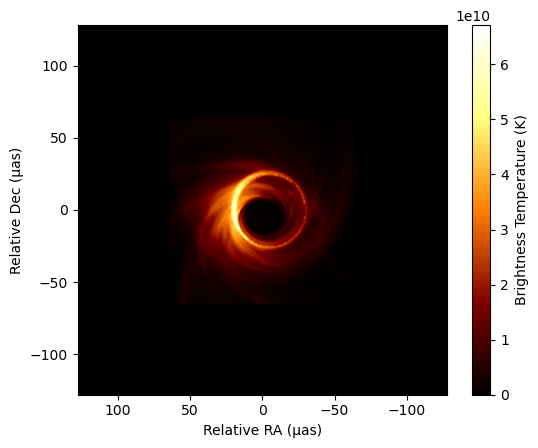
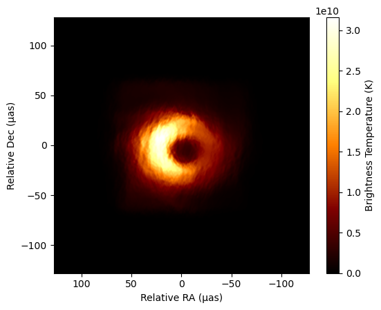

```@meta
CurrentModule = ScatteringOptics
```

# Tutorial
This example code segment uses ScatteringOptics.jl to simulate interstellar scattering on an input [Comrade.jl](https://github.com/ptiede/Comrade.jl) `SkyModel` object via the `image_scatter()` function.


```julia
using ScatteringOptics
using EHTImages
using PythonPlot
using EHTUtils

# Load a model image FITS file
im = load_fits("jason_mad_eofn.fits")
# Initialize a comrade SkyModel from the loaded image
imap = intensitymap(im)
# Plot source image
imshow(im, angunit=EHTUtils.μas)
```


Optionally, users can retrieve a purely diffractive scattering ensemble average image with the `convolve` function in `VLBISkyModels.jl`.

```julia
# Initialize a scattering model with desired scattering paramaters, otherwise default ISM parameters are used
# The default model is a Dipole model
sm = ScatteringModel()

# Create kernel from scattering model
skm = kernelmodel(sm, νref=230e9)

# Convolve to get the ensemble averaged image
using VLBISkyModels
imap_ea = convolve(imap, skm)

# Map and plot convolved image
im_ea = copy(im)
map!(im_ea, imap_ea)
imshow(im_ea, angunit=EHTUtils.μas)
```


Otherwise, the scattering kernel `skm` is not required to obtain a fully scattered image. A `RefractivePhaseScreen` type object may be initialized from the `ScatteringModel` and image dimensions. 

```julia
# Create a refractive phase screen model from scattering model and image dimensions
nx, ny = size(imap) 
dx = imap.X.step.hi  # pixel size in radians
dy = imap.Y.step.hi 
rps = RefractivePhaseScreen(sm, nx, ny, dx, dy) # sm is the scattering model

# Produce scattered image with observing wavelength .13 cm
s = image_scatter(rps, imap, 0.13, νref=230e9)

# Load and plot scattered image
im_sc = load(s)
im_sc.f[1] = 230e9
imshow(im_sc, angunit=EHTUtils.μas)
```

