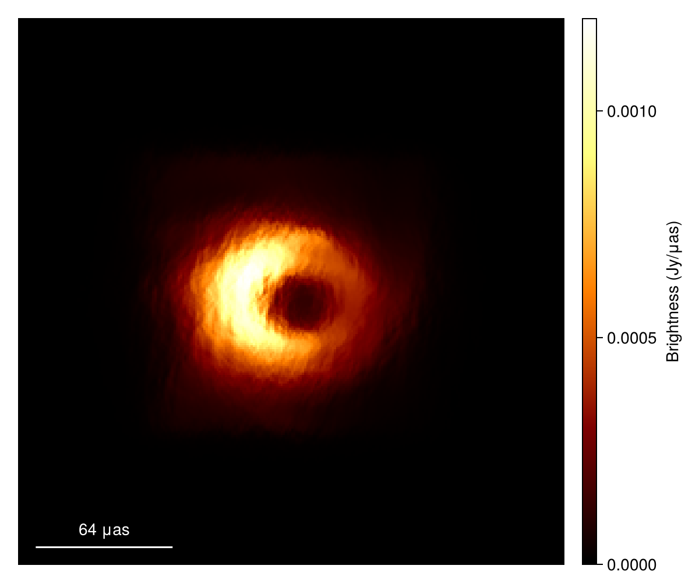

# Summary 
`ScatteringOptics.jl` is an astronomy software package developed in the Julia programming language [@Bezanson_2012]. 
It implements physical models for the anisotropic scattering of radio waves, which arise from turbulence in the ionized interstellar medium. 
This toolkit excels in simulating and modeling the temporal, spatial, and spectral effects of interstellar scintillation in the strong scattering regime, taking advantage of Julia's speed and composability. 
The package provides essential functionalities for modeling, analyzing, and interpreting the images of the Galactic Center's supermassive black hole, Sagittarius A*, especially with the Event Horizon Telescope, as well as the images of extremely high brightness temperature emissions in active galactic nuclei using space very long baseline interferometry.

# Statement of Need
Scintillation is a well-known phenomenon in astronomy. In radio wavelengths, electron density fluctuations in the ionized interstellar plasma cause scattering of radio waves, resulting in the scintillation of compact radio sources in the sky [@Rickett_1990; @Narayan_1992]. The interstellar scintillation produces temporal and spectral modulations (i.e., twinkling) in the brightness of objects, as well as distortion of the source images. 
Interstellar scattering of radio emission typically occurs in the strong scattering regime, dominated by two distinct effects: diffractive and refractive scattering. Diffractive scattering, arising from small-scale fluctuations, typically causes angular broadening of the source image. Conversely, refractive scattering, resulting from large-scale fluctuations, introduces \'refractive substructures\' into the observed image [@GN_1989; @NG_1989; @Johnson_2015].

Scattering has become increasingly important in high-angular-resolution studies of compact radio sources at micro-arcsecond scales using very long baseline interferometry (VLBI). 
Notable examples include event-horizon-scale imaging of the Milky Way's supermassive black hole, Sagittarius A* (Sgr A*), with the Event Horizon Telescope [@EHTSgrAPaper1; @EHTSgrAPaper3; @EHTSgrAPaper4], and studies of extremely high brightness temperature emissions in active galactic nuclei (AGNs) using space VLBI, exemplified by projects like RadioAstron [@Johnson_2016_3C273]. 
In both scenarios, the observed interferometric data is influenced by both diffractive and refractive scattering effects. 
This has driven the development of a theoretical framework [@Johnson_Narayan_2016; @Johnson_2016; @Johnson_2018; @Psaltis_2018] that can model, simulate, and assess these effects on both the sky images and the interferometric measurements.

`ScatteringOptics.jl` implements physical models for anisotropic interstellar scattering, based on the fast \'stochastic optics\' framework, using a single thin-phase screen [@Johnson_2015; @Johnson_Narayan_2016]. The package offers capabilities to simulate diffractive and refractive scattering effects on sky images and interferometric measurements. It provides reference implementations of three different analytic, probabilistic models for the phase screen, as introduced in @Psaltis_2018 and widely used in the community. Additionally, `ScatteringOptics.jl` includes a set of abstract types that enable users to define other phase screen models. Designed for seamless integration, the package natively works with sky models and interferometric data types from the advanced Bayesian radio interferometric modeling package `Comrade.jl` [@Tiede_2022]. This integration allows for the incorporation of advanced scattering models into radio interferometric imaging of Sgr A* and other AGNs using the EHT and other VLBI arrays.

The package leverages the strengths of the Julia programming language, which is designed for high-performance computing. A major advantage of Julia is its speed. Programs written in Julia are compiled into efficient native machine code, offering speed comparable to optimized C/C++ or Fortran, and often achieving performance more than a hundred times faster than Python. This speed provides a factor of 10-100 acceleration compared to the current standard implementation of scattering models in Python. This acceleration significantly enhances current state-of-the-art techniques for deriving the maximum posteriori estimate of joint models, including the sky model and phase screens [@Johnson_2016], and also enables the utilization of novel Bayesian inference techniques (available in `Comrade.jl` and related libraries) for deriving full posterior distributions of scattering parameters.

# Mathematics
`ScatteringOptics.jl` implements a single thin-screen scattering model described in @Johnson_2018 and @Psaltis_2018 that simulates both diffractive and refractive scattering. In many instances, the properties of the interstellar scattering can be well described by a single, thin phase-changing screen $\phi_r(r)$, where $r$ is a transverse coordinate on the screen. The statistical characteristics of scattering can be described by those of the phase screen through its spatial structure function $D_\phi(r)$.

Diffractive scattering causes the angular broadening of the source image. 
The diffractively scattered image ${I_{ea}}(r)$ is mathematically given by the convolution of the source image ${I_{src}}(r)$ with a blurring scattering kernel, ${G}(r)$, 

$${I_{ea}}(r) = {I_{src}}(r) * {G}(r),$$

where $r$ refers to the two-dimensional phase screen coordinate vector. In radio interferometry, each set of measurements, so-called visibilities, obtained with a pair of antennas at different time and frequency segments, samples a Fourier component of the sky image. The source visibilities, $V_{src}(b)$, are related to the diffractively scattered visibilities, $V_{ea}(b)$, by,

$$V_{ea}(b) = V_{src}(b)\,\text{exp}\left[-\frac{1}{2} D_\phi\left(\frac{b}{1+M}\right)\right],$$

in which $b$ is the baseline vector between observing stations. The magnification $M=D/R$ is the ratio of earth-screen distance $D$ to screen-source distance $R$. 

Refractive scattering further introduces compact substructures on the diffractively-scattered, angular-broadened images. 
The compact substructures arise from phase gradients on the scattering screen $\nabla \phi_r(r)$.
The refractively scattered image ${I_{a}}(r)$ is given by

$${I_{a}}(r) \approx {I_{ea}}(r + r_F^2 \nabla \phi_r(r)),$$

in which the Fresnel scale, $r_F = \sqrt{\frac{DR}{D+R}\frac{\lambda}{2\pi}}$ is dependent on the observing wavelength $\lambda$ [@Johnson_Narayan_2016]. 

`ScatteringOptics.jl` implements three analytic probabilistic models for the phase screen $\phi_r(r)$, named Dipole, Periodic Boxcar, and Von Mises models in @Psaltis_2018, providing the corresponding semi-analytic descriptions of the phase structure function $D_\phi(r)$. The default model is the Dipole model, known to be consistent with multi-frequency measurements of Sgr A* [@Johnson_2018] and being used as the standard model in the Event Horizon Telescope Collaboration [@EHTSgrAPaper2; @EHTSgrAPaper3; @EHTSgrAPaper4].


# Example Usage

This example code segment uses ScatteringOptics.jl to simulate interstellar scattering on an input skymodel of [Comrade.jl](https://github.com/ptiede/Comrade.jl) [@Tiede_2022].

```
using CairoMakie
using ScatteringOptics 
using StableRNGs
using VLBISkyModels

# Load a image model from an image FITS file
im = load_fits("data/jason_mad_eofn.fits", IntensityMap)

# Plot source image
imageviz(im, size=(600, 500), colormap=:afmhot)
```


```
# Initialize a scattering model with desired scattering paramaters, otherwise default ISM parameters are used
# The default model is a Dipole model with the best-fit parameters for Sgr A*
sm = ScatteringModel()

# Here using StableRNG for the reproducibility
rng = StableRNG(123)

# Create a refractive phase screen model from scattering model and image dimensions
# Produce the scattered image
im_sc = scatter_image(sm, im; rng=rng)

# Plot source image
imageviz(im_sc, size=(600, 500), colormap=:afmhot)
```


# Acknowledgements
We thank Dongjin Kim and Vincent Fish for their helpful discussions related to the development of this package.
This work was made possible by grants from the National Science Foundation (NSF; AST-1950348 and AST-2034306). 
K.A. and P.T. have been financially supported also by other NSF grants (AST-1935980, OMA-2029670, AST-2107681, AST-2132700). 
The Black Hole Initiative at Harvard University is funded by grants from the John Templeton Foundation and the Gordon and Betty Moore Foundation to Harvard University.
