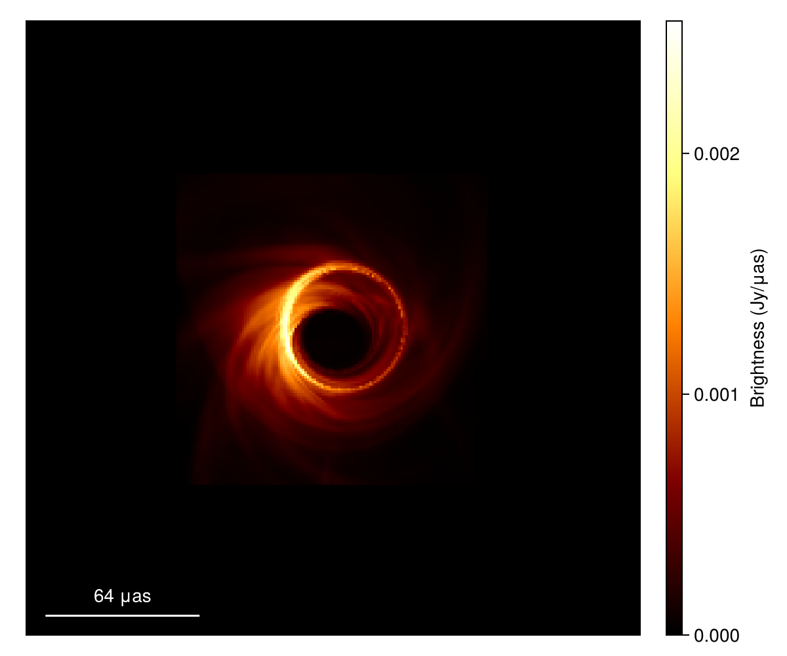

# Summary 

ScatteringOptics implements the Stochastic Optics [@Johnson_2016; @Johnson_2018] framework for generating realistic Interstellar Medium (ISM) scattering effects on very-long-baseline interferometry (VLBI) models. The package is written in the Julia programming language and is intended for use in Event Horizon Telescope (EHT) imaging of the black hole at our galactic center, Sagitarrius A*.

# Statement of Need

The Interstellar Medium causes distortion and scattering effects in Radio Astronomy VLBI imaging. Wave propagation of radio emission through the ISM's turbulent ionized plasma results in scintillation and long time-scale variability of the source image. A mitigation framework which addresses these effects is required for Event Horizon Telescope (EHT) VLBI imaging of Sagittarius A*, the supermassive black hole located at the center of the Milky Way [@ehtsaga]. The galactic ISM between earth and the black hole acts as a 2-dimensional inhomogeneous scattering screen, producing diffractive and refractive scattering effects in interferometric data. 

The EHT imaging process, currently implemented in the Python programming language, resembles a Bayesian optimization algorithm. Using a forward modelling strategy, model guesses of the final image are constructed first, scattered, and then compared with the real image data gathered by the telescope. This repeats over thousands of iterations in order to obtain the best fit image reconstruction, amplifying the effects of slow simulation algorithms. The Julia Programming Language offers fast and efficient computational abilities, holding the potential to significantly accelerate scattering simulations. It furthermore features advanced AD algorithms that can streamline existing image reconstruction procedures and allow a self-consistent joint-modelling of scattering parameters. `ScatteringOptics` provides a full framework for ISM-scattering mitigation to be implemented in the forward model imaging process.

# Mathematics

The EHT addresses scattering effects by simulating diffractive and refractive scintillation effects individually and then synthesizing them. Diffractive scattering is addressed by constructing a blurring kernel, ${G}(r)$, where $r$ refers to the two-dimensional phase screen cordinate vector. Convolution of the source image, ${I_{src}}(r)$, with this kernel yields a diffractively scattered ensemble average image:

$${I_{ea}}(r) = {I_{src}}(r) * {G}(r).$$

The scattering kernel is built on a phase structure function, $D_\phi(r)$, which describes the scattering screen irregularities that produce scintillation effects [@psaltis2018model]. There are three different phase structure functions (Dipole, Periodic Boxcar, and Von Mises) that reflect different statistical magnetohydrodynamical models, though the EHT primarily uses the Dipole model. The above equation reflects convolution in image space, however EHT data is processed and scattered in Fourier space visibilities. Convolution of source visibilities, $V_{src}(b)$, is computed as:

$$V_{ea}(b) = V_{src}(b) * \text{exp}\left[-\frac{1}{2} D_\phi(\frac{b}{1+M})\right]$$

in which $b$ is the baseline vector between observing stations. The magnification, $M$ is the ratio of earth-screen distance to screen-source distance: $D/R$. 

Refractive scattering requires the construction of a stochastic phase screen, ${\phi_r} (r)$, adhering to phase fluctuation dependence on the ISM-specific 2-dimensional power law: 

$$P(\vec{f} ) = \bar{Q} \cdot (|\vec{f}| r_{\text{in}})^{-(\alpha + 2)} \cdot e^{-(|\vec{f}| r_{\text{in}})^2} \cdot P_{\phi}(\phi)$$

where $\phi$ is the angular polar coordinate of $\vec{f}$. The constant $\bar{Q}$, inner scale $r_{\text{in}}$, index $\alpha$, and function $P_{\phi}(\phi)$ derive from the scattering kernel phase structure function [@psaltis2018model]. Phase gradients on the scattering screen provide refractive scintillation effects in the computation of the final average image:

$${I_{a}}(r) = {I_{src}}(r) * {G}(r)  +  r_F^2[\nabla \phi_r(r)] \cdot [\nabla ({I_{src}}(r) * {G}(r))]$$

in which the Fresnel scale, $r_F = \sqrt{\frac{DR}{D+R}\frac{\lambda}{2\pi}}$ is dependent on the observing wavelength $\lambda$, earth-screen distance $D$, and the screen-source distance $R$. ${I_{a}}(r)$ represents the output of the module's `image_scatter` function: the input source model with fully simulated refractive and diffractive scattering effects.

# Example Usage

This example code segment uses ScatteringOptics.jl to generate ISM scattering on an input [Comrade.jl](https://github.com/ptiede/Comrade.jl) `SkyModel` [@Tiede2022].

```
using ScatteringOptics
using EHTImages
using PythonPlot
using EHTUtils

# Load a model image FITS file
im = load_fits("jason_mad_eofn.fits")
# Initialize a comrade SkyModel from the loaded image
imap = intensitymap(im)
# Plot source image
imshow(im, angunit=EHTUtils.μas)
```


```
# Initialize a scattering model with desired scattering paramaters, otherwise default ISM parameters are used
# The default model is a Dipole model
sm = ScatteringModel()

# Create a refractive phase screen model from scattering model and image dimensions
nx, ny = size(imap) 
dx = imap.X.step.hi  # pixel size in radians
dy = imap.Y.step.hi 
rps = RefractivePhaseScreen(sm, nx, ny, dx, dy) # sm is the scattering model

# Produce scattered image with observing wavelength .13 cm
s = image_scatter(rps, imap, 0.13, νref=230e9)

# Load and plot scattered image
im_sc = load(s)
im_sc.f[1] = 230e9
imshow(im_sc, angunit=EHTUtils.μas)
```

